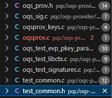

# Installation (this project was installed on Raspberry Pi 5 (aarch64))


## Setting up the Raspberry Pi 5
- Environment
  - Raspberry Pi 5 (aarch64)
- Settings
  1. Install Raspbian OS (e.g., Raspberry Pi OS (64-bit))
  2. OS customization
     1. Host setting: raspberrypi.local
     2. Set User name and password
     3. (optional) Set wireless LAN
     4. Use SSH with password authentication
  3. Connect Wifi
  4. Change Properties
     1. Raspberry Pi Configuration -> Localisation
     2. Set Locale, Country -> US (United States), Character Set -> UTF-8
     3. Set Timzone, Area -> US, Location -> Central
     4. Set Keyboard, Layout -> English (US)
     5. Set Wireless LAN Country, Country -> US (United States)
     6. Change password (It might be different from waht you wanted because of keyboard difference)
     7. Turn off Auto login
     8. reboot
  5. (Optional)Turn On Raspberry Pi Connect and Sign in
  6. Now, you might be access to the your raspberry pi server 
     1. ```ssh raspberrypi.local```
  7. Update your installed packages
     1. ```sudo apt update && sudo apt full-upgrade -y```
  8. (Optional) Update your raspberry pi firmware
     1. ```sudo rpi-update```
     2. ```sudo reboot```


## Install oqs-provider (It includes the installation of the openssl and liboqs libraries)


<!-- It is required to explain host setting, e.g., install docker, docker compose, etc. -->


1. Clone the repository
```bash
git clone $(git address)
cd socket-network
```

1. Move to the pqc project directory ($(ROOT_DIR)/pqc/)
```bash
cd pqc
# git submodule update --init --recursive
```
1. Run server and client dockers by docker compose
```bash
(path: $(ROOT_DIR)/pqc/)
docker compose up -d
```

1. Set the server's docker environment -> install oqs-provider
```bash
(path: $(ROOT_DIR)/pqc/)
docker exec -it pqc_server bash
    (pqc_server container)
    (path: /)
    cd socket/pqc/
    (path: /socket/pqc/)
    bash setup.sh
    source ~/.bashrc
    (path: /socket/pqc/)
    (Optional: If you want to test the installation)
    cd oqs-provider
    cd _build && ctest --parallel 5 --rerun-failed --output-on-failure -V
    (path: /socket/pqc/_build/)
    (Optional) Give a permission to the root directory
    chmod 777 -R ../..
```

1. Set the client's docker environment -> install oqs-provider
```bash
(path: $(ROOT_DIR)/pqc/)
docker exec -it pqc_client bash
    (pqc_client container)
    ... # Same to that executed in the server container
```

1. 
```bash

```


##### Example
1. Generate a digital certificate
```bash
openssl req -x509 -new -newkey falcon1024 -keyout falcon1024_CA.key -out falcon1024_CA.crt -nodes -subj "/CN=test CA" -days 365 -config /usr/local/ssl/openssl.cnf
openssl genpkey -algorithm falcon1024 -out falcon1024_srv.key
openssl req -new -newkey falcon1024 -keyout falcon1024_srv.key -out falcon1024_srv.csr -nodes -subj "/CN=test server" -config /usr/local/ssl/openssl.cnf
openssl x509 -req -in falcon1024_srv.csr -out falcon1024_srv.crt -CA falcon1024_CA.crt -CAkey falcon1024_CA.key -CAcreateserial -days 365
```
2. Run server
```bash
openssl s_server -cert falcon1024_srv.crt -key falcon1024_srv.key -www -tls1_3 -groups mlkem512
```
3. Run client
```bash
openssl s_client -groups mlkem512
```


<!-- 지금 연결은 되는데, verification 21 <- 서버 인증서를 신뢰할 수 없어서 발생하는 문제임. TLS 연결은 성공적으로 설정됨> -->
이거 s_client 실행할 때, "-CAfile falcon1024_CA.crt" 넣어주면, verification code:0 으로 통과 가능


<!-- c code로 실행하는 건 아직 검증 안 됨 -->
This is Hee-Yong's implementation
```bash
(path: /socket/pqc/)
cd src
(path: /socket/pqc/src/)
mkdir build
cd build
(path: /socket/pqc/src/build)
cmake ..
make
./server
./client
```



- Cert related codes


<!-- ## How to add submodule
```bash
git submodule add <repositoy.git>
(example)
git submodule add https://github.com/open-quantum-safe/oqs-provider.git
git submodule update --init --recursive
``` -->